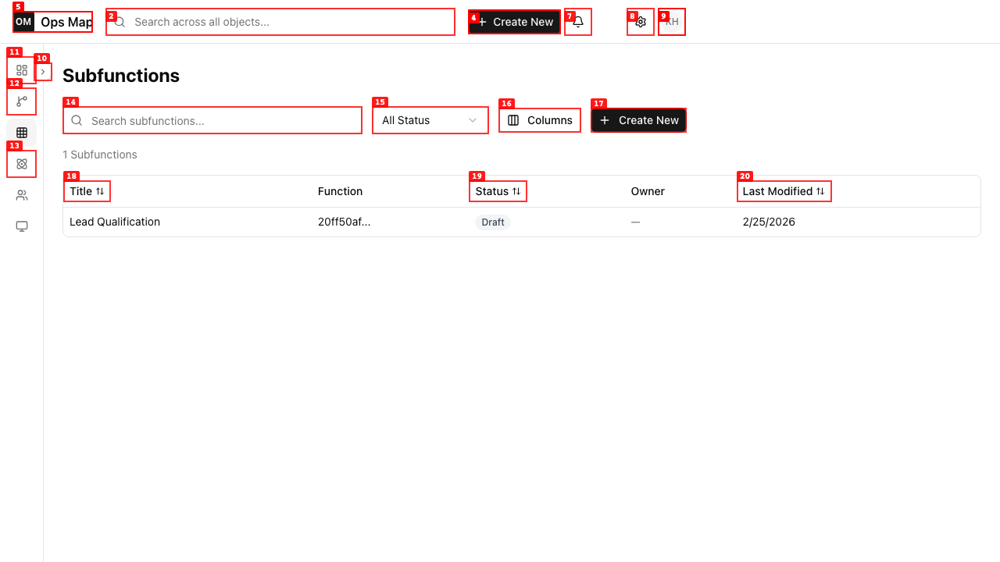
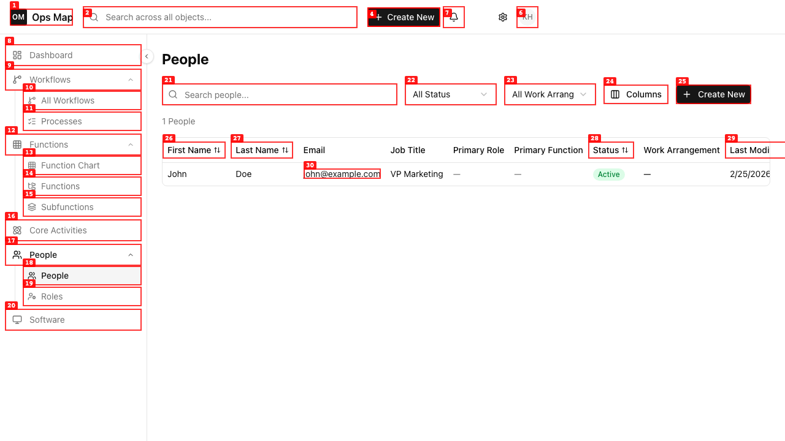
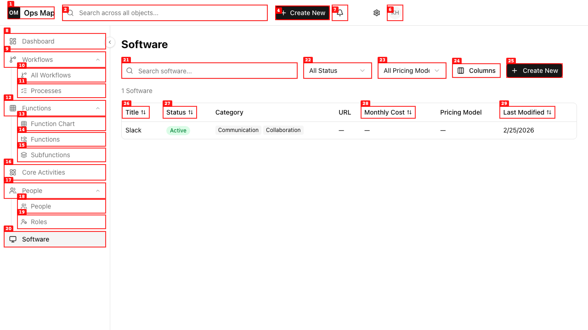
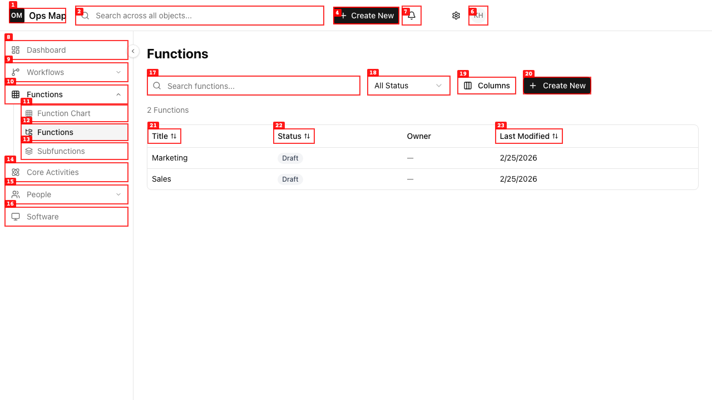

# Dogfood Report: Ops Map

| Field | Value |
|-------|-------|
| **Date** | 2026-02-25 |
| **App URL** | https://operationsmap.vercel.app |
| **Session** | operationsmap |
| **Scope** | Full app |

## Summary

| Severity | Count |
|----------|-------|
| Critical | 0 |
| High | 0 |
| Medium | 2 |
| Low | 2 |
| **Total** | **4** |

## Issues

### ISSUE-001: Subfunctions list shows raw UUID instead of function name

| Field | Value |
|-------|-------|
| **Severity** | medium |
| **Category** | functional |
| **URL** | https://operationsmap.vercel.app/subfunctions |
| **Repro Video** | N/A |

**Description**

The "Function" column on the Subfunctions list page displays a truncated UUID ("20ff50af...") instead of the parent function's name (e.g., "Sales"). This makes it impossible for users to identify which function a subfunction belongs to.

**Repro Steps**

1. Navigate to Subfunctions (sidebar > Functions > Subfunctions)
   

2. **Observe:** The "Function" column shows "20ff50af..." (a UUID) instead of the function name like "Sales".

---

### ISSUE-002: Console warning - Missing aria-describedby for DialogContent

| Field | Value |
|-------|-------|
| **Severity** | low |
| **Category** | accessibility |
| **URL** | All pages |
| **Repro Video** | N/A |

**Description**

Every page load produces a console warning: `Warning: Missing 'Description' or 'aria-describedby={undefined}' for {DialogContent}`. This is an accessibility issue where Radix DialogContent components lack proper ARIA descriptions.

**Repro Steps**

1. Open any page and check the browser console
2. **Observe:** Warning about missing Description or aria-describedby for DialogContent appears

---

### ISSUE-003: Filter dropdown text truncation on People and Software pages

| Field | Value |
|-------|-------|
| **Severity** | low |
| **Category** | visual |
| **URL** | https://operationsmap.vercel.app/people, https://operationsmap.vercel.app/software |
| **Repro Video** | N/A |

**Description**

Filter dropdown buttons have truncated text due to insufficient width. On the People page, "All Work Arrangements" shows as "All Work Arrang...". On the Software page, "All Pricing Models" shows as "All Pricing Mode...". Users can't read the full filter label.

**Repro Steps**

1. Navigate to People page
   

2. **Observe:** The work arrangement filter shows "All Work Arrang..." instead of "All Work Arrangements"

3. Navigate to Software page
   

4. **Observe:** The pricing model filter shows "All Pricing Mode..." instead of "All Pricing Models"

---

### ISSUE-004: Table rows not accessible as interactive elements

| Field | Value |
|-------|-------|
| **Severity** | medium |
| **Category** | accessibility |
| **URL** | All list pages (Functions, Processes, Workflows, etc.) |
| **Repro Video** | N/A |

**Description**

Table rows in list views (Functions, Processes, Workflows, Software, People, etc.) navigate to the record detail page when clicked, but they are not exposed as interactive elements in the accessibility tree. They lack proper `role`, `tabindex`, and `cursor` styling, making them inaccessible to keyboard navigation and screen readers. The rows use JS `onClick` on `<tr>` elements but don't signal interactivity to assistive technology.

**Repro Steps**

1. Navigate to any list page (e.g., Functions)
   

2. **Observe:** Table rows visually function as links but are not keyboard-focusable and don't appear as interactive in the accessibility tree.

---
